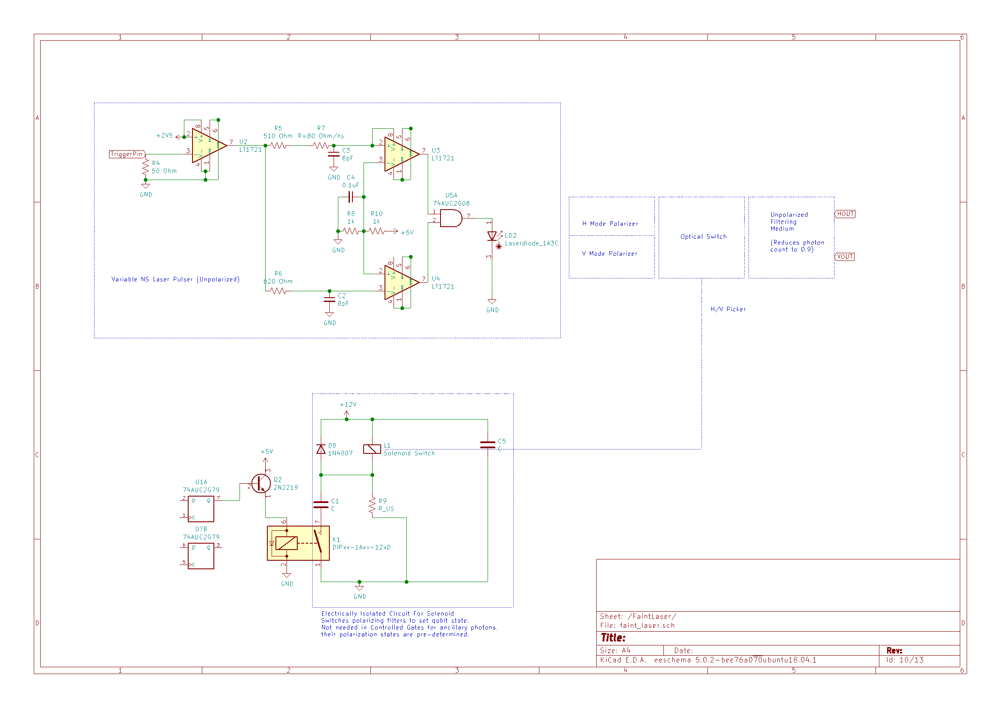
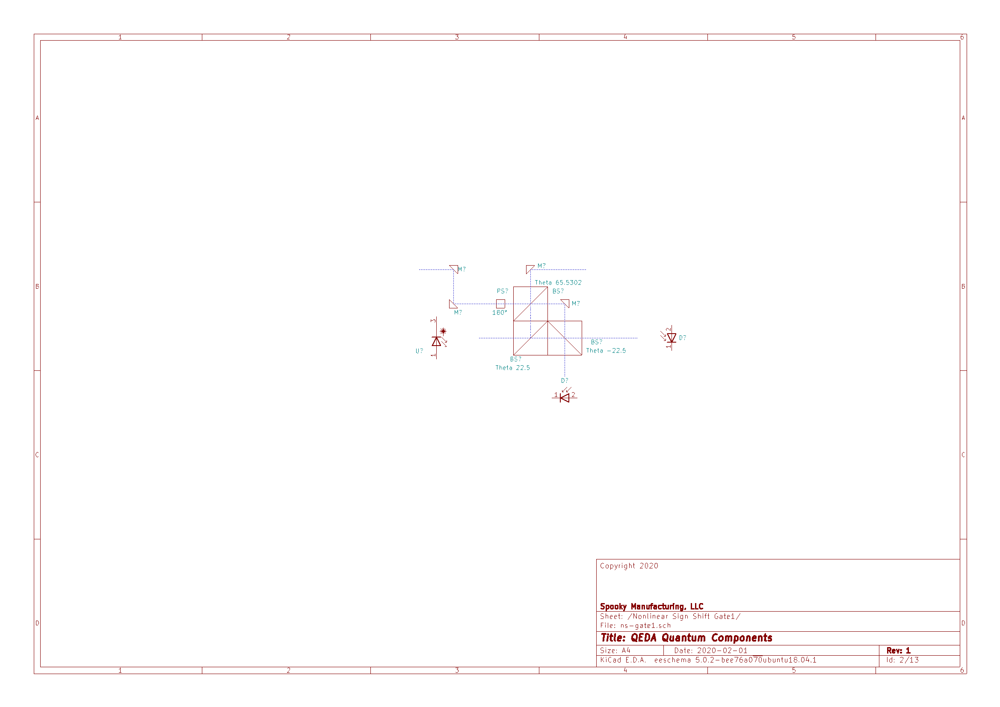
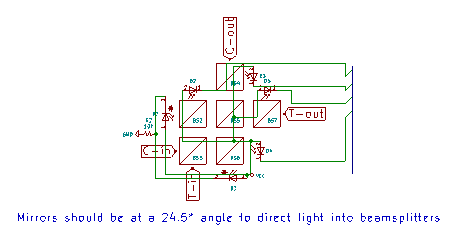

# QCore

## Theory of Operation

The 8Q QCore in an 8 qubit general purpose processor which uses polarization encoded photons to perform computation. Qubits are created and pass through fiber-optic switches which determine their route, sending the qubit to the various quantum logic gates along polarization-maintaining fiber-optic wires. The result of each logic gate is then moved to a fiber optic 'register' or resonator if you prefer, this gives the control circuitry the necessary time to read the next instructions and set the switches to detail the qubits new path. Following this, the control circuitry sends an electrical pulse to allow the register switches to open and the qubit then travels out towards the new circuit.

### Qubit Description

Each qubit in the system has two modes H and V which correspond to the binary values 0 and 1 as shown in the table below

| H    | 0    |
| ---- | ---- |
| V    | 1    |

These modes are physical paths which the photon (our qubit) travels as shown in the circuit diagram below.

#### Qubit Modes

### Single Photon Sources

In order for us to achieve true quantum computation, we require a single photon source (SPS), unfortunately at the time of this writing there are no affordable commercially available SPS on the market that we can make use of. To get around this issue, we utilize a technology known as a faint laser. The way this works is we pulse a laser extremely fast to generate a laser beam with a very small number of photons and pass it through a filtering medium to reduce the number of photons. This is a probabilistic operation, and so does not guarantee a single photon on every operation, however with proper materials selection, single photon generation can be made arbitrarily close to 1. 

**NOTE:** Because of this workaround, our SPS is not [anti-bunched](https://en.wikipedia.org/wiki/Photon_antibunching) making this iteration of the processor unsuitable for cryptographic purposes.

The circuit diagram for a faint laser SPS is provided below. Each qubit will have its' own SPS and the Controlled Logic Gates will have their own SPS as well.

The SPS consists of a sub-nanosecond laser driver which takes an input called "TriggerPin", when this input is set to HIGH it causes a very fast pulse of light to be generated by the laser diode. The photons then travel to a polarizing beam splitter where approximately 50% of the photons are passed to each mode. To set the state of the qubit, an input is passed to a digital FlipFlop gate which powers a relay and an isolate solenoid which blocks the path of one or the other mode to create a vacuum state in one mode and allow photons in the other mode. Both modes then pass through an unpolarized filtering medium to reduce the photon count with a probability near, but below 1.

#### Faint Laser SPS

### Quantum Logic Gates

#### Primitives

##### NSx Gate

Quantum computing is non-linear, however the Pauli Gates are linear, that is to say that they are deterministic gates. In order to achieve quantum computation that is more useful than classical simulation we have to introduce the element of non-linearity, or indeterministic states. To achieve this, we use modified versions of the Non-linear sign-flip gate or NSx Gate. The NSx Gate is a single-qubit operation that performs a phase-shift on one mode conditioned on two ancillary modes.

#### Measure

The measurement gate counts the number of photons in each mode for each qubit, to do this a silicon photomultiplier is used in both H and V modes.

#### Unitary Gates

##### Pauli-X Gate

The Pauli-X Gate performs a NOT operation or bit flip on a single qubit.
X|0> = |1>

##### Pauli-Y Gate

The Pauli-Y Gate rotates one qubit around the y axis, it looks similar to an X gate, but with a global phase diffrence of i or -i.
Y|0> = i|1> and Y|1> = -i|0>
Note: This Pauli gate does not invert itself.

##### Pauli-Z Gate

The Pauli-X Gate performs a NOT operation or bit flip on a single qubit, this time in the +/- basis.
Z|-> = |+>

##### Hadamard Gate

The Hadamard gate swaps basis states between 1/0 and +/-. It is often used to create a superposition.
H|1> = |+> , H|-> = |0> 

#### Controlled Gates

Controlled gates utilize nonlinear sign-flip gates to introduce non-linearity into our programs. These non-linearities are extremely difficult to simulate as they actually entangle our qubit states, whereas the Unitary qubit transformations are easy to simulate comparatively. Effectively this is what gives our quantum computer an edge over typically digital computing.
They act on two qubits, the Control and Target. If the Control is 1, the operation is carried out otherwise it isn't.

##### CX Gate

The Controlled-X Gate (shorthand: CX) performs a controlled NOT operation on two qubits. 

##### CY Gate

The Controlled-Y Gate (shorthand: CY) performs a controlled Pauli-Y operation on two qubits.

##### CZ Gate

The Controlled-Z Gate (shorthand: CZ) performs a controlled Pauli-Z operation on two qubits.

##### CH Gate

The Controlled-H Gate (shorthand: CH) performs a controlled Hadamard operation on two qubits.

