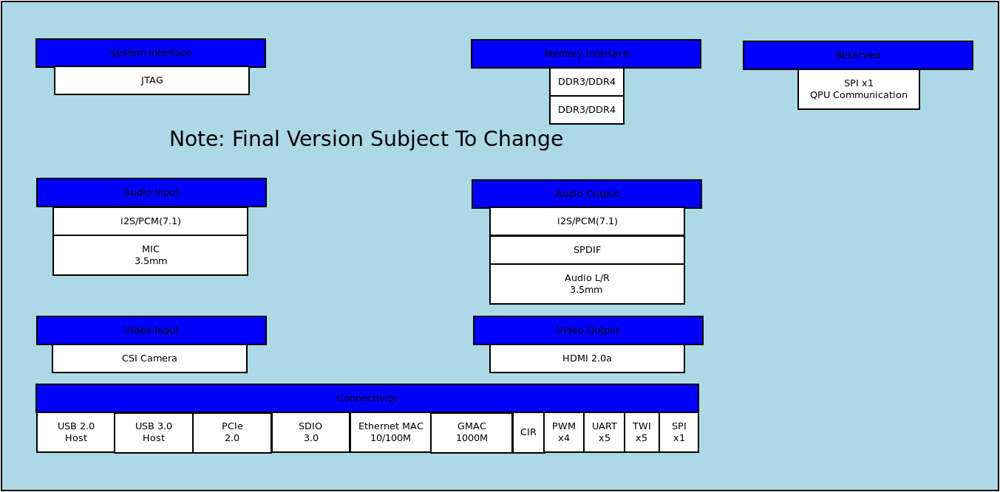
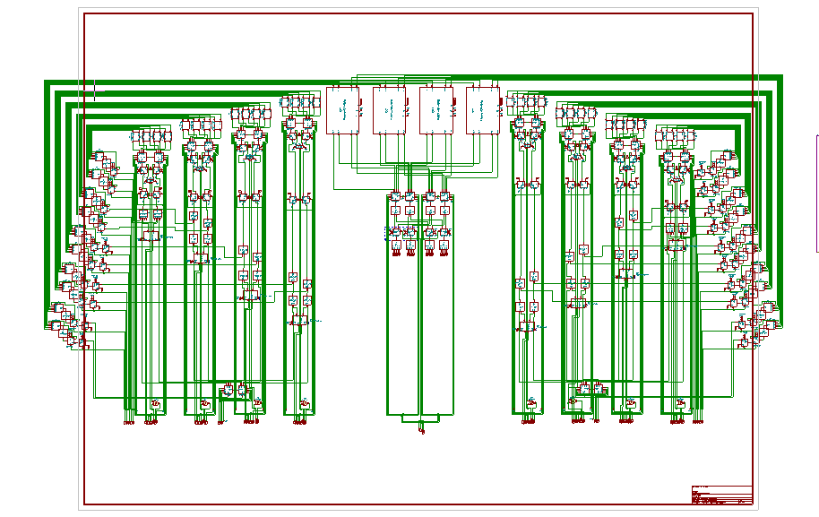

# 8Q
<!-- ALL-CONTRIBUTORS-BADGE:START - Do not remove or modify this section -->

<!-- ALL-CONTRIBUTORS-BADGE:END -->
Computer with built-in General Purpose 8 Qubit Optical Quantum Processor

## Features

* Quad-Core Cortex-A53
* Mali-T720 MP2 GPU
* 1x DDR4 Ram Slot (Max 64GB)
* 32/64 Bit Compatible
* Linux Capable

# Status
The 8Q processor is currently in development

## Contributors ✨

Thanks goes to these wonderful people ([emoji key](https://allcontributors.org/docs/en/emoji-key)):

<!-- ALL-CONTRIBUTORS-LIST:START - Do not remove or modify this section -->
<!-- prettier-ignore-start -->
<!-- markdownlint-disable -->
<table>
  <tr>
    <td align="center"><a href="https://github.com/NoahGWood"> <b>Noah Wood</b></a> <a href="https://github.com/Spooky-Manufacturing/8Q/commits?author=NoahGWood" title="Tests">⚠️</a></td>
  </tr>
</table>

<!-- markdownlint-enable -->
<!-- prettier-ignore-end -->
<!-- ALL-CONTRIBUTORS-LIST:END -->

This project follows the [all-contributors](https://github.com/all-contributors/all-contributors) specification. Contributions of any kind welcome!